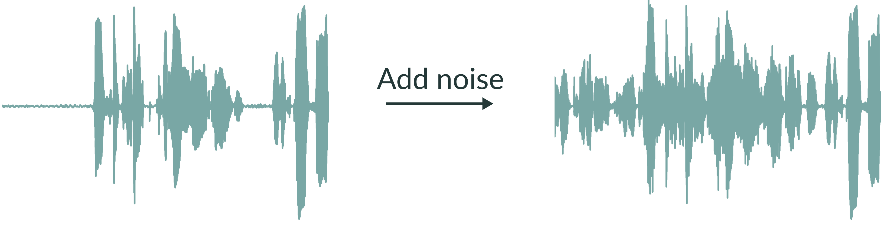

.. ---------------------------------------------------------------------------
.. Copyright 2017 Intel(R) Nervana(TM)
.. Licensed under the Apache License, Version 2.0 (the "License");
.. you may not use this file except in compliance with the License.
.. You may obtain a copy of the License at
..
..      http://www.apache.org/licenses/LICENSE-2.0
..
.. Unless required by applicable law or agreed to in writing, software
.. distributed under the License is distributed on an "AS IS" BASIS,
.. WITHOUT WARRANTIES OR CONDITIONS OF ANY KIND, either express or implied.
.. See the License for the specific language governing permissions and
.. limitations under the License.
.. ---------------------------------------------------------------------------

audio
=====

aeon performs a series of customizable transformations on the audio before provisioning the data to the model.

1. Probabilistically add noise to raw audio waveform (with the probability controlled by the ``add_noise_probability`` parameter). Noise is chosen from a random file in ``noise_index_file`` and added at a random offset and scaling (controlled by the ``noise_level`` parameter).  Noise addition happens only in the time domain (as opposed to the spectral domain).

2. If ``time_scale_fraction`` has been set to a pair of values ``(tmin, tmax)``, then the spectral frames will be randomly squeezed or stretched in the time domain according to a random value chosen uniformly from the interval between ``tmin`` and ``tmax``.  For example:

.. csv-table::
   :header: "Parameter", "Default", "Description"
   :widths: 20, 20, 40
   :delim: |
   :escape: ~

    noise_index_file (string)| | File of pathnames to noisy audio files, one per line.
    noise_level (tuple(float, float))| (0.0, 0.5) | How much noise to add (a value of 1 would be 0 dB SNR). Each clip applies its own value chosen randomly from with the given bounds.
    add_noise_probability (float)| 0.0 | Probability of adding noise
    time_scale_fraction (tuple(float, float))| (1.0, 1.0) | Scale factor for simple linear time-warping. Each clip applies its own value chosen randomly from with the given bounds.
