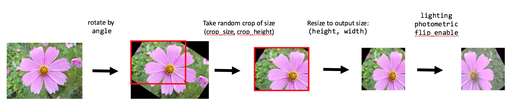

.. ---------------------------------------------------------------------------
.. Copyright 2017 Intel(R) Nervana(TM)
.. Licensed under the Apache License, Version 2.0 (the "License");
.. you may not use this file except in compliance with the License.
.. You may obtain a copy of the License at
..
..      http://www.apache.org/licenses/LICENSE-2.0
..
.. Unless required by applicable law or agreed to in writing, software
.. distributed under the License is distributed on an "AS IS" BASIS,
.. WITHOUT WARRANTIES OR CONDITIONS OF ANY KIND, either express or implied.
.. See the License for the specific language governing permissions and
.. limitations under the License.
.. ---------------------------------------------------------------------------

image
=====

aeon performs a series of customizable transformations on the image before provisioning the data to the model, shown in the schematic below:

1. Rotate the image by a random angle drawn from a uniform distribution between the provided ranges (parameter ``angle (int, int)``), and fill the padded regions with zeros.
2. Take a random crop of the image. The size of the crop is controlled by the parameters ``scale`` and ``do_area_scale``. Suppose the width is the short-side of the input image. By default, the crop width will then be a ``scale`` fraction of the width of the image. Optionally, if ``do_area_scale`` is enabled, then total area of the crop will be a ``scale`` fraction of the input image area. The proportions of the crop box match that of the output shape, unless horizontal_distortion is required.
3. Adds padding for the image with ``padding`` number of pixels on each side. It then takes random crop of the padded image. The cropbox size is equal to original image size (not changing the output image size then). It cannot be combined with previous crop step, so `crop_enabled` has to be set to `false`.
4. Resize the cropped image to the desired output shape, defined by the parameters ``height`` and ``width``.
5. If required, apply any transformations (e.g. lighting, horizontal flip, photometric distortion)

.. csv-table::
   :header: "Parameter", "Default", "Description"
   :widths: 20, 10, 50
   :delim: |
   :escape: ~

   flip_enable (bool) | False | Apply horizontal flip with probability 0.5.
   scale (float, float) | (1, 1) | Fraction of image short-side length to take the crop.
   do_area_scale (bool) | False | Determine the crop size as a fraction of total area instead of short-side length.
   angle (int, int) | (0, 0) | Rotate image by a random angle drawn from the provided ranges. Angle is in degrees.
   lighting (float, float) | (0.0, 0.0) |  Mean and Standard deviation for distribution of values used as input to colorspace perturbation as described in  Krizhevksy et al.  Default value of 0.0 std means that no colorspace perturbation is applied.  Otherwise, three random variables are drawn from the normal distribution and used to create a pixel color bias based on pre-trained principal components.
   horizontal_distortion (float, float) | (1, 1) | Change the aspect ratio by scaling the image width by a random factor.
   contrast (float, float) | (1.0, 1.0) |  Boundaries of a uniform distribution from which to draw a contrast adjustment factor.  A contrast adjustment factor of 1.0 results in no change to the contrast of the image.  Values less than 1 decrease the contrast, while values greater than 1 increase the contrast.  Recommended boundaries for random contrast perturbation are (0.9 and 1.1).
   brightness (float, float) | (1.0, 1.0) | Boundaries of a uniform distribution from which to draw a brightness adjustment factor.  A brightness adjustment factor of 1.0 results in no change to the brightness of the image.  Values less than 1 decrease the brightness, while values greater than 1 increase the brightness.  Recommended boundaries for random brightness perturbation are (0.9 and 1.1).
   hue (int) | (0, 0) | Boundaries of a uniform distribution from which to draw a hue adjustment factor. Factors are multiples of 2 degrees, so a full turn is 180. Recommented boundaries for random hue shift are (-18, 18).
   saturation (float, float) | (1.0, 1.0) | Boundaries of a uniform distribution from which to draw a saturation adjustment factor.  A saturation adjustment factor of 1.0 results in no change to the saturation of the image.  Values less than 1 decrease the saturation, while values greater than 1 increase the saturation.  Recommended boundaries for random saturation perturbation are (0.9 and 1.1)
   center (bool) | False | Take the center crop of the image. If false, a randomly located crop will be taken.
   crop_enable (bool) | True | Crop the input image using ``center`` and ``scale``/``do_area_scale``
   padding (int) | 0 | Size of the padding added to the image. Cannot be combined with ``crop_enable`` set to ``true``, because it crops the padded image to adjust to the original input image size.
   fixed_aspect_ratio (bool) | False | Maintain fixed aspect ratio when copying the image to the output buffer. This may result in padding of the output buffer.
   fixed_scaling_factor (float) | | If set, uses fixed scaling factor for output image size.
   expand_probability (float) | 0.0 | Probability of expanding image. Used for SSD.
   emit_constraint_type ["center", "min_overlap", ""] | \"\" | Used for constraining output bounding boxes in SSD augmentations. `center` means center of ground truth box needs to be present in cropped box. `min_overlap` means that coverage of ground thruth box with cropped box should be equal or bigger than provided value.
   emit_constraint_min_overlap (float) | "" | Minimum overlap used when `emit_constraint_type` is set to `min_overlap`.
   expand_ratio (float, float) | (1.0, 1.0) | Ratio to expand image in SSD. minimum expand ratio cannot be less than 1.
   batch_samplers (batch_sampler) |  | Batch samplers are objects defining patch generation in SSD.
   debug_output_directory (string) | "" | Writes transformed images and transformation parameters to the provided directory.

**batch_sampler** object:

.. csv-table::
   :header: "Parameter", "Default", "Description"
   :widths: 20, 10, 50
   :delim: |
   :escape: ~

   max_sample (int) | | If provided, break when found certain number of samples satisfing the sample_constraint.
   max_trials (int) | 100 | Maximum number of trials for sampling to avoid infinite loop
   sampler (sampler)  | | Object describing sampling parameters
   sample_constraint (sample_constraint) | | Object descibing sample constraints

**sampler** object:

.. csv-table::
   :header: "Parameter", "Default", "Description"
   :widths: 20, 10, 50
   :delim: |
   :escape: ~

   scale (float, float) | (1.0, 1.0) | patch scale
   aspect_ratio (float, float) | (1.0, 1.0) | patch aspect ratio

**sample_constraint** object:

It's a set of constraints for generating patch (cropbox). They concern candidate patch and ground truth box. They are not taken under consideration if not set. At least one set of constraints (jaccard_overalp or sample_coverage or object_coverage) must be met to accept patch.

.. csv-table::
   :header: "Parameter", "Description"
   :widths: 20, 50
   :delim: |
   :escape: ~

   min_jaccard_overlap (float) | Min value of jaccard overlap: (sample ∩ bounding box) / (sample ∪ bounding box)
   max_jaccard_overlap (float) | Max value of jaccard overlap: (sample ∩ bounding box) / (sample ∪ bounding box)
   min_sample_coverage (float) | Min value of sample (patch) coverage: (sample ∩ bounding box) / sample
   max_sample_coverage (float) | Max value of sample (patch) coverage: (sample ∩ bounding box) / sample
   min_object_coverage (float) | Min value of object (boudning box): coverage (sample ∩ bounding box) / bounding box
   max_object_coverage (float) | Max value of object (bounding box): coverage (sample ∩ bounding box) / bounding box
