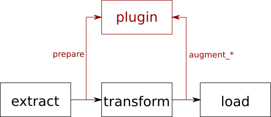

.. ---------------------------------------------------------------------------
.. Copyright 2017 Nervana Systems Inc.
.. Licensed under the Apache License, Version 2.0 (the "License");
.. you may not use this file except in compliance with the License.
.. You may obtain a copy of the License at
..
..      http://www.apache.org/licenses/LICENSE-2.0
..
.. Unless required by applicable law or agreed to in writing, software
.. distributed under the License is distributed on an "AS IS" BASIS,
.. WITHOUT WARRANTIES OR CONDITIONS OF ANY KIND, either express or implied.
.. See the License for the specific language governing permissions and
.. limitations under the License.
.. ---------------------------------------------------------------------------

Plugins
=======

aeon has an experimental feature of customizable augmentation transformation plugins performed right after the standard augmentation pipeline.

1. Prepare plugin parameters for next data record
2. If required, apply any specified transformations (e.g. crop, lighting, horizontal flip, photometric distortion) to record element (e.g. image, boundingbox)
3. Apply plugin transformations if provided to record elements (e.g. image, boundingbox)

User Guide
----------

To compile aeon with python plugin support, add cmake flag ``-DPYTHON_PLUGIN=ON``.

For Python 3.5.2 you need to install OpenCV 3.3 (from sources - not available through apt-get).

Also python ``yaml`` package is required for a single unit test to pass, as it provides better json parser used in ``plugins/scale.py``.

To use python augmentation plugins, you need to specify ``PYTHONPATH`` environment variable:

.. code-block:: bash

    export PYTHONPATH=$PYTHONPATH:/home/user/aeon/plugins

And your config as for example:

.. code-block:: python

    cfg = {
           'manifest_filename': manifest_file,
           'manifest_root': manifest_root,
           'batch_size': 20,
           'block_size': 40,
           'cache_directory': cache_root,
           'etl': [
               {'type': 'image',
                'channel_major': False,
                'width': 28,
                'height': 28,
                'channels': 1},
               {'type': 'label',
                'binary': False}
           ],
           'augmentation': [
               {'type': 'image',
               'plugin_filename': 'rotate',
               'plugin_params': {"angle": [-45,45]}}
           ]
        }

In the above example, the ``plugin_filename`` points to module ``rotate.py`` located in ``$PYTHONPATH``, and ``plugin_params`` is a dictionary with arguments to the plugin. 
In case of this example rotate plugin, there is the optional argument ``angle`` specified. Consult your plugin provider or the plugin file for details on what arguments are supported.

Other examples are:

.. code-block:: python

           'augmentation': [
               {'type': 'image',
               'plugin_filename': 'flip',
               'plugin_params': {"probability": 0.5}}
           ]

           'augmentation': [
               {"type": "audio",
               "plugin_filename": "scale",
               "plugin_params": {"probability": 1,
                                 "amplitude": [0.1, 0.1]}
               }
           ]

Developer Guide
---------------

The base class for plugin implemented as follows:

.. code-block:: python

    import sys

    class Plugin:
        def __init__(self):
            pass

        def prepare(self):
            print('prepare not implemented')
            raise RuntimeError('Not implemented')

        def augment_image(self, image):
            print('augment image not implemented')
            raise RuntimeError('Not implemented')

        def augment_boundingbox(self, bboxes):
            print('augment boundingbox not implemented')
            raise RuntimeError('Not implemented')

        def augment_pixel_mask(self, pixel_mask):
            print('augment pixel mask not implemented')
            raise RuntimeError('Not implemented')

        def augment_depthmap(self, depthmap):
            print('augment depthmap not implemented')
            raise RuntimeError('Not implemented')

        def augment_audio(self, audio):
            print('augment audio not implemented')
            raise RuntimeError('Not implemented')

Therefore by default the plugin throws exception when it is called.
To write your own plugin overwrite the methods you wish to support.

.. csv-table::
   :header: "Method", "Argument", "Description"
   :widths: 20, 10, 50
   :delim: |
   :escape: ~

    __init__(self, param_string) | json string | Constructor taking json string, which you have to parse. If you want required arguments (as opposed to optional), throw an exception if there is no key you need.
    prepare(self)| ~"~" | Called before every record (line) in manifest, usually to generate random values or switches
    augment_image(self, image) | image cv::Mat | Image for classification, detection, etc.
    augment_boundingbox(self, bboxes) | list of objects with fields "xmin", "xmax", "ymin", "ymax", "label", "difficult", "truncated" | Takes a list of bounding boxes for detection. See :doc:`boundingbox <provider_boundingbox>` 
    augment_pixel_mask(self, pixel_mask) | Pixelmask image for segmentation problems as cv::Mat | See :doc:` pixelmask <provider_pixelmask>`
    augment_depthmap(self, depthmap) | cv::Mat depthmap | Depthmap
    augment_audio(self, audio) | audio samples or fft as cv::Mat | The type depends on what feature type was specified in the configuration file

Example plugin flip:

.. code-block:: python

    # import your headers
    import numpy as np
    import cv2
    import json
    from plugin import Plugin

    # define your class as *plugin* inheriting after Plugin base class
    class plugin(Plugin):
        # define your local variables
        probability = 0.5
        do_flip = False
        width = 0

        # constructor can parse the configuration parameters provided in form of json string
        def __init__(self, param_string):
            if len(param_string) > 0:
                params = json.loads(param_string)
                # optional
                if params.has_key("probability"):
                    self.probability = params["probability"]
                # required
                if params.has_key("width"):
                    self.width = params["width"]
                else:
                    raise KeyError('width required for flip.py')

        # prepare method is called before each record (line) in manifest is processed.
        def prepare(self):
            # if randomly decided to flip, store the boolean in a variable until the next line is processed
            self.do_flip = np.random.uniform() < self.probability

        # flip image
        def augment_image(self, mat):
            if self.do_flip:
                dst = cv2.flip(mat, 1)
            else:
                dst = mat
            return dst

        # flip boundingboxes
        def augment_boundingbox(self, boxes):
            if self.do_flip:
                for i in range(len(boxes)):
                    xmax = boxes[i]["xmax"]
                    boxes[i]["xmax"] = self.width - boxes[i]["xmin"] - 1
                    boxes[i]["xmin"] = self.width - xmax - 1
            return boxes

        # pixelmask and depthmap can essentially be treated the same as image in case of flipping
        def augment_pixel_mask(self, mat):
            return self.augment_image(mat)

        def augment_depthmap(self, mat):
            return self.augment_image(mat)

You can find more plugin examples in ``plugins`` directory.
