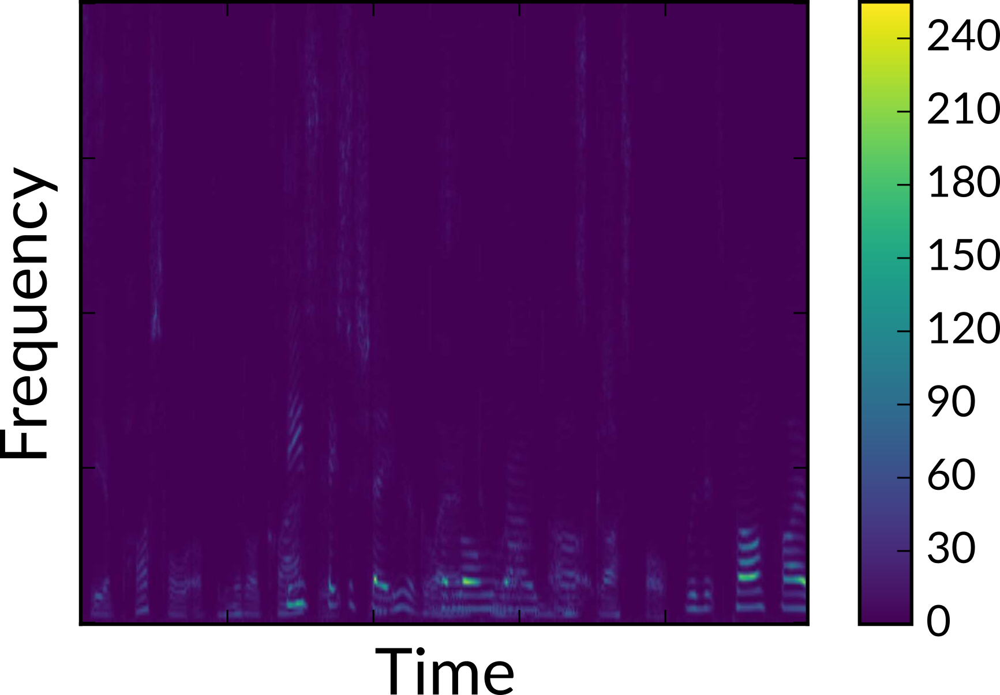
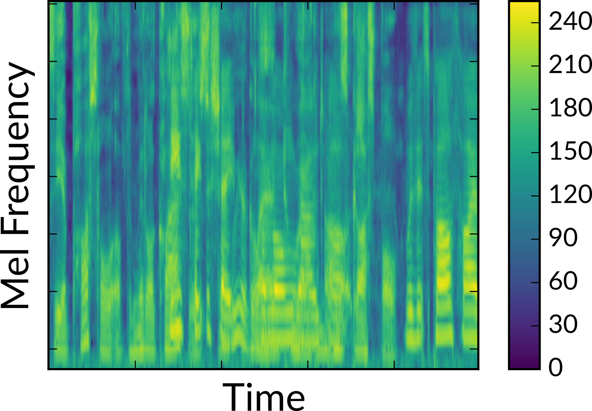
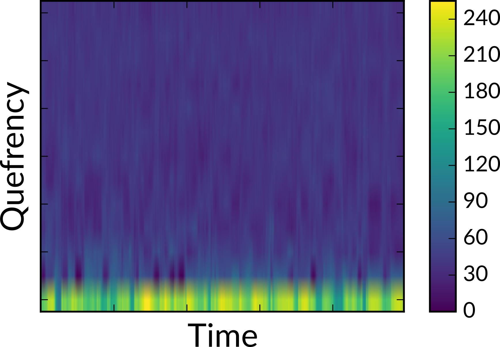

.. ---------------------------------------------------------------------------
.. Copyright 2017 Intel(R) Nervana(TM)
.. Licensed under the Apache License, Version 2.0 (the "License");
.. you may not use this file except in compliance with the License.
.. You may obtain a copy of the License at
..
..      http://www.apache.org/licenses/LICENSE-2.0
..
.. Unless required by applicable law or agreed to in writing, software
.. distributed under the License is distributed on an "AS IS" BASIS,
.. WITHOUT WARRANTIES OR CONDITIONS OF ANY KIND, either express or implied.
.. See the License for the specific language governing permissions and
.. limitations under the License.
.. ---------------------------------------------------------------------------

audio
=====

For audio data, Aeon has providers for both classification and transcription tasks. Currently, audio can be stored in any file format handled by the sox_ command line utility (e.g. .wav, .mp3, .aiff), but must first be converted to 16-bit, single channel. This conversion is done by the user before calling the dataloader. For example, to convert ``*.wav`` files to the correct format, one could use:

.. code-block:: bash

    find . -name '*.wav'  | parallel 'sox {} -b 16 {} channels 1 rate 16k'

This single line finds all ``*.wav`` files and converts them in-place and in parallel using sox.

From there, the user should create a manifest file that specifies paths to both the audio and any target files. To provision just the audio data, the manifest would just list the audio files, one per line::

    @FILE
    audio_sample_1.wav
    audio_sample_2.wav
    audio_sample_3.wav

When the data is provisioned to the model, Aeon can output the raw waveform (``feature_type: samples``) or transform it into three different feature spaces: spectrograms (``feature_type: specgram``), mel-frequency spectral coefficients (``feature_type: mfsc``), or mel-frequency cepstral coefficients (``feature_type: mfcc``). The full provisioning pipeline is described below, along with some key parameters:

1.  Extract the samples corresponding to the raw audio waveform from the encoded file or buffer. If ``feature_type`` is "samples", then we can stop here.

2. Compute a spectrogram from the audio waveform. The resolution is determined by the ``frame_length`` parameter and the stride by the ``frame_stride`` parameter. If ``feature_type`` is "specgram", then we can stop here.

3. Compute the mel-frequency spectral coefficients (MFSC) from the spectrogram. The resulting MFSC has ``num_filters`` mel-frequency bands, where each band is a  weighted combination of frequency bands from the input spectrogram, according to the mel scale. If ``feature_type`` is "mfsc", then we can stop here.

4. Compute the mel-frequency cepstral coefficients (MFCC) from the MFSC. The resulting MFCC has ``num_cepstra`` cepstral bands.

The complete table of configuration parameters is shown below:

.. csv-table::
   :header: "Name", "Default", "Description"
   :widths: 20, 20, 40
   :delim: |
   :escape: ~

    max_duration (string)| *Required* | Maximum duration of any audio clip ("seconds" or "samples", e.g. "4 seconds")
    frame_stride (string)| *Required* | Interval between consecutive frames ("seconds" or "samples")
    frame_length (string)| *Required* | Duration of each frame ("seconds" or "samples")
    sample_freq_hz (uint32_t)| 16000 | Sample rate of input audio in hertz
    feature_type (string)| ~"specgram~" | Feature space to represent audio. One of "samples", "specgram", "mfsc", or "mfcc"
    window_type (string)| ~"hann~" | Window type for spectrogram generation. Currently supported windows are "hann", "hamming", "blackman", and "bartlett".
    num_filters (uint32_t)| 64 | Number of filters to use for mel-frequency transform (used for feature_type = "mfsc" or "mfcc")
    num_cepstra (uint32_t)| 40 | Number of cepstra to use (only for feature_type = "mfcc")
    noise_index_file (string)| | File of pathnames to noisy audio files, one per line.
    noise_level (tuple(float, float))| (0.0, 0.5) | How much noise to add (a value of 1 would be 0 dB SNR). Each clip applies its own value chosen randomly from with the given bounds.
    add_noise_probability (float)| 0.0 | Probability of adding noise
    time_scale_fraction (tuple(float, float))| (1.0, 1.0) | Scale factor for simple linear time-warping. Each clip applies its own value chosen randomly from with the given bounds.
    emit_length (bool) | False | Produce a buffer indicating the length of the audio output buffer
    output_type (string)| ~"uint8_t~"| Output data type. If feature_type = "samples" then this should be "int16" or "float". Otherwise it should stay at "uint8_t".

You can configure the audio processing pipeline from python using a dictionary as follows:

.. code-block:: python

    audio_config = {"type": "audio",
                    "sample_freq_hz": 16000,
                    "max_duration": "3 seconds",
                    "frame_length": "256 samples",
                    "frame_stride": "128 samples",
                    "noise_index_file": "/path/to/noise_index_file",
                    "window_type": "hann"}

    augmentation_config = {"type": "audio",
                           "add_noise_probability": 0.5,
                           "noise_level": (0.5, 1.0)}

When providing audio only, the buffers provisioned to the model are:

.. csv-table::
   :header: "Buffer Name", "Shape", "Description"
   :widths: 20, 10, 45
   :delim: |
   :escape: ~

   audio | ``(N, F, T)`` | Transformed audio, where ``F = number of bands``, ``T = max timepoints``, and ``N = bsz`` (the batch size).
   audio_length | ``(N)`` | Length of audio buffer in ``output_type`` units.  Only produced if ``emit_length`` is true in the configuration.

.. _sox: http://sox.sourceforge.net/
.. _neon: https://github.com/NervanaSystems/neon
.. _warp CTC: https://github.com/baidu-research/warp-ctc
