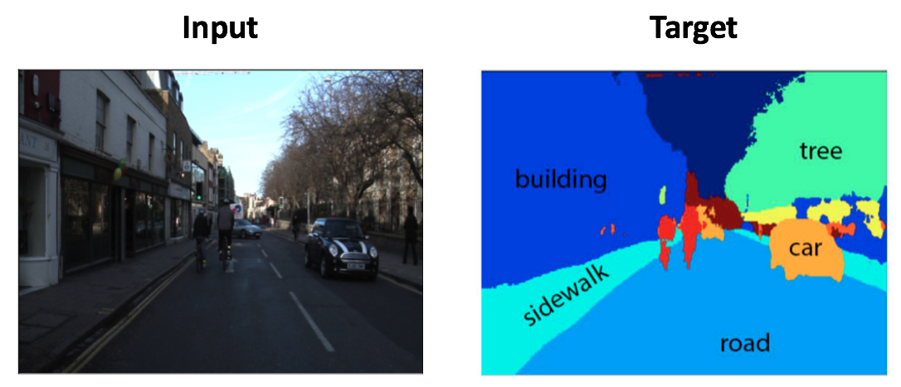

.. ---------------------------------------------------------------------------
.. Copyright 2017 Intel(R) Nervana(TM)
.. Licensed under the Apache License, Version 2.0 (the "License");
.. you may not use this file except in compliance with the License.
.. You may obtain a copy of the License at
..
..      http://www.apache.org/licenses/LICENSE-2.0
..
.. Unless required by applicable law or agreed to in writing, software
.. distributed under the License is distributed on an "AS IS" BASIS,
.. WITHOUT WARRANTIES OR CONDITIONS OF ANY KIND, either express or implied.
.. See the License for the specific language governing permissions and
.. limitations under the License.
.. ---------------------------------------------------------------------------

pixelmask
=========

For segmentation problems (``type=pixelmask``), the input is an image, and the target output is a same-sized image where each pixel is assigned to a category. In the image below using the KITTI dataset, each pixel is assigned to object categories (sidewalk, road, car, etc.):

The manifest file contains paths to the input image, as well as the target image:

.. code-block:: bash

    @FILE	FILE
    /image_dir/img1.jpg	/mask_dir/mask1.png
    /image_dir/img2.jpg	/mask_dir/mask2.png
    /image_dir/img3.jpg	/mask_dir/mask3.png
    .

Note that the target image should have a single channel only. If there are multiple channels, only the first channel from the target will be used. The image parameters are the same as above, and the pixelmask has zero configurations. Transformations such as photometric or lighting are applied to the input image only, and not applied to the pixel mask. The same cropping, flipping, and rotation settings are applied to both the image and the mask.

.. csv-table::
   :header: "Name", "Default", "Description"
   :widths: 20, 10, 50
   :delim: |
   :escape: ~

   height (uint) | *Required* | Height of provisioned image (pixels)
   width (uint) | *Required* | Width of provisioned image (pixels)
   name (string) | ~"~" | Name prepended to the output buffer name
   channels (uint) | 3 | Number of channels in input image
   output_type (string)| ~"uint8_t~"| Output data type.
   seed (int) | 0 | Random seed

The buffers provisioned to the model are:

.. csv-table::
   :header: "Buffer Name", "Shape", "Description"
   :widths: 20, 10, 45
   :delim: |
   :escape: ~

   pixelmask | ``(N, H, W)`` | Target pixel image.
