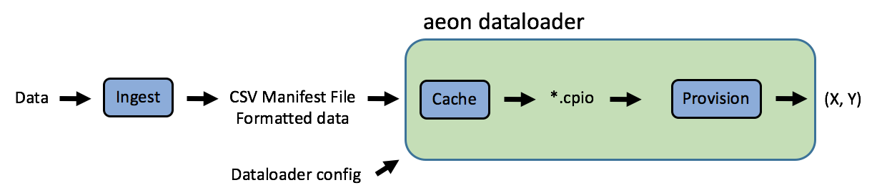

.. ---------------------------------------------------------------------------
.. Copyright 2017 Intel(R) Nervana(TM)
.. Licensed under the Apache License, Version 2.0 (the "License");
.. you may not use this file except in compliance with the License.
.. You may obtain a copy of the License at
..
..      http://www.apache.org/licenses/LICENSE-2.0
..
.. Unless required by applicable law or agreed to in writing, software
.. distributed under the License is distributed on an "AS IS" BASIS,
.. WITHOUT WARRANTIES OR CONDITIONS OF ANY KIND, either express or implied.
.. See the License for the specific language governing permissions and
.. limitations under the License.
.. ---------------------------------------------------------------------------

User Guide
==========

The aeon dataloader is designed to deal with large datasets from different modalities, including image, video, and audio, that may be too large to load directly into memory. We use a macrobatching approach, where the data is loaded in chunks (macrobatches) that are then split further into minibatches to feed the model.

The dataloader was created to provide an easy interface to configure the loader for custom datasets, and also to load data from disk to neon with minimal latency. The basic workflow is show in the schematic below:

Users first perform **ingest**, which means converting their data into a format supported by the dataloader (if needed), and generating a manifest file in tab-separated values (tsv) format. This file tells the dataloader where the input and target data reside.

Given a configuration file, the aeon dataloader takes care of the rest (green box). During operation, the first time a dataset is encountered, the dataloader will **cache** the data into `cpio <https://en.wikipedia.org/wiki/Cpio>`_ format, allowing for quick subsequent reads. This is an optional but highly recommended step.

During **provision**, the dataloader reads the data from disk, performs any needed transformations on-the-fly, transfers the data to device memory (e.g. GPU), and provisions the data to the model as an input-target pair. We use a multi-threaded library to hide the latency of these disk reads and operations in the device compute.

The caching step can be skipped by providing an empty ``cache_directory`` configuration (see below). In that case, the dataloader will read directly from the source data files.

Note that **ingest** (creation of the manifest files and any data formatting needed) occurs outside aeon by the user since they are specific to the dataset.

Data format
-----------

As mentioned above, users interact with the dataloader by providing two items:

1. Manifest file, a tab-separated file (\*.tsv).
2. Configuration parameters, as a ``json`` structure.

Operations such as generating training/testing splits, or balancing labels for imbalanced datasets should be implemented outside of the dataloader by the user during **ingest** to create the appropriate manifest files. Several example ingest scripts are in the neon repository.

Manifest file
-------------

The manifest file contains UTF-8 text lines. Each line is one of header, comment, or record.

Header
^^^^^^
A header line contains encoding details for each element in a record line.
The header line starts with a '@' character and one tab separated encoding field per record element.
A header line must be located prior to any record lines.
Elements in the header are one of FILE, BINARY, STRING, ASCII_INT, or ASCII_FLOAT.
Header line is required.

FILE
~~~~
An absolute or relative path. Relative paths work in conjunction with the *manifest_root* keyword.  The contents of the file are interpreted

BINARY
~~~~~~
Base64 encoded text.  Useful for including images inline with the manifest file.

STRING
~~~~~~
Literal string.

ASCII_INT
~~~~~~~~~
A text integer that is converted to a 4 byte binary value.

ASCII_FLOAT
~~~~~~~~~~~
A text floating point number that is converted to a 4 byte float value.

Comment
^^^^^^^
A comment is a line that starts with the '#' character

Record
^^^^^^
A record is any non-blank line that is not a header or comment.  All records in the manifest must have the same number of elements.

.. code-block:: bash

    <record_1_element_1>[tab]<record_1_element_2>
    <record_2_element_1>[tab]<record_2_element_2>
    ...
    <record_N_element_1>[tab]<record_N_element_2>

In the image classification case,

.. code-block:: bash

    @FILE[tab]ASCII_INT
    /image_dir/faces/naveen_rao.jpg[tab]0
    /image_dir/faces/arjun_bansal.jpg[tab]0
    /image_dir/faces/amir_khosrowshahi.jpg[tab]0
    /image_dir/fruits/apple.jpg[tab]1
    /image_dir/fruits/pear.jpg[tab]1
    /image_dir/animals/lion.jpg[tab]2
    /image_dir/animals/tiger.jpg[tab]2
    ...
    /image_dir/vehicles/toyota.jpg[tab]3

Note that above, the target labels are simply numerical indexes that correspond to a categorical label.

For audio transcription, paths to target transcriptions are included:

.. code-block:: bash

    @FILE[tab]FILE
    audio_sample_1.wav[tab]audio_transcript_1.txt
    audio_sample_2.wav[tab]audio_transcript_2.txt
    audio_sample_3.wav[tab]audio_transcript_3.txt

For example formats of different modalities and problems, see the image, audio, and video sections.

Configuration
-------------

The dataloader configuration consists of a base loader configuration, then individual configurations for the different modalities. These configurations are captured by a json structure, which can be created via a dictionary in python. For example,

.. code-block:: python

    import json
    from aeon import DataLoader

    image_config =        {"type": "image",
                           "height": 224,
                           "width": 224}

    label_config =        {"type": "label",
                           "binary": True}

    augmentation_config = {"type": "image",
                           "flip_enable": True}

    aeon_config =         {"manifest_filename": "train.tsv",
                           "etl": (image_config, label_config),
                           "augment": (augmentation_config),
                           "batch_size": 128}

    train_set = DataLoader(json.dumps(aeon_config))

Importantly, the ``type`` key indicates to the dataloader which input data type to expect, and the ``image`` and ``label`` keys correspond to additional configuration dictionaries. The dataloader currently supports:

.. csv-table::
   :header: "Name", "Augmentation", "Description"
   :widths: 20, 10, 50
   :escape: ~
   :delim: |

   image|image|
   label||
   audio|audio|
   localization|image|
   localization_ssd|image|
   pixelmask|image|
   boundingbox|image|
   blob||
   video|image|
   char_map||
   label_map||

aeon is designed to be modular and developer-friendly, so its relatively easy to write your own dataloader type and register it with the dataloader. For more information, see our Developer Guide.

The possible base loader configurations are the following (configurations without a default are required)

.. csv-table::
   :header: "Name", "Default", "Description"
   :widths: 20, 10, 50
   :escape: ~
   :delim: |

   manifest_filename (string)| *Required* | Path to the manifest file.
   manifest_root (string)| ~"~" |
   batch_size (int)| *Required* | Batch size. In neon, typically accesible via ``be.bsz``.
   batch_major (bool)| True | If set to `true`, the data order is N,DATA. Otherwise it's DATA,N (where DATA is any sequence of data, e.g., N,C,H,W to C,H,W,N for images).
   manifest_root (string) | ~"~" | If provided, ``manifest_root`` is prepended to all manifest items with relative paths, while manifest items with absolute paths are left untouched.
   cache_directory (string)| ~"~" | If provided, the dataloader will cache the data into ``*.cpio`` files for fast disk reads.
   subset_fraction (float)| 1.0 | Fraction of the dataset to iterate over. Useful when testing code on smaller data samples.
   shuffle_enable (bool) | False | Shuffles the dataset order for every epoch
   shuffle_manifest (bool) | False | Shuffles manifest file contents
   decode_thread_count (int)| 0 | Number of threads to use. If default value 0 is set, Aeon automatically chooses number of threads to logical number of cores diminished by two. To execute on a single thread, use value of 1
   pinned (bool)| False |
   random_seed (uint)| 0 | Set not a zero value if you need to have deterministic output. In that case aeon will always produce the same output for given a particular input.
   iteration_mode (string)|"ONCE"| Can be "ONCE", "COUNT", or "INFINITE"
   iteration_mode_count||
   etl||
   augmentation||
   remote|| Configuration of connection with aeon service in distrubted dataloading scenario. Please take a look at :doc:`service <service>` documentation.

Example python usage
--------------------

While aeon can be used within a purely C++ environment, we have included a python class ``DataLoader`` for integration into a python environment. As an example of an image classification dataset, we first specify a python dictionary with confguration settings:

.. code-block:: python

    image_config =        {"type": "image",
                           "height": 224,
                           "width": 224}

    label_config =        {"type": "label",
                           "binary": True}

    augmentation_config = {"type": "image",
                           "flip_enable": True}

    aeon_config = {"manifest_filename": "train.tsv",
                   "etl": (image_config, label_config),
                   "augment": (augmentation_config),
                   "batch_size": 128}

The above configuration will, for each image, take a random crop of 224x224 pixels, and perform a horizontal flip with probability 0.5. We then generate our dataloader:

.. code-block:: python

    import json
    from aeon import DataLoader

    train_set = DataLoader(json.dumps(aeon_config))

The backend argument above from neon tells the dataloader where to place the buffers to provision to the model.

Logging
-------------

There are three levels of logs in aeon:
* INFO - prints all logs
* WARNING - prints only warnings and errors
* ERROR - prints only errors
Default log level is WARNING. You can set it with `AEON_LOG_LEVEL` environmental variable. For example
`export AEON_LOG_LEVEL=INFO` sets log level to INFO.
